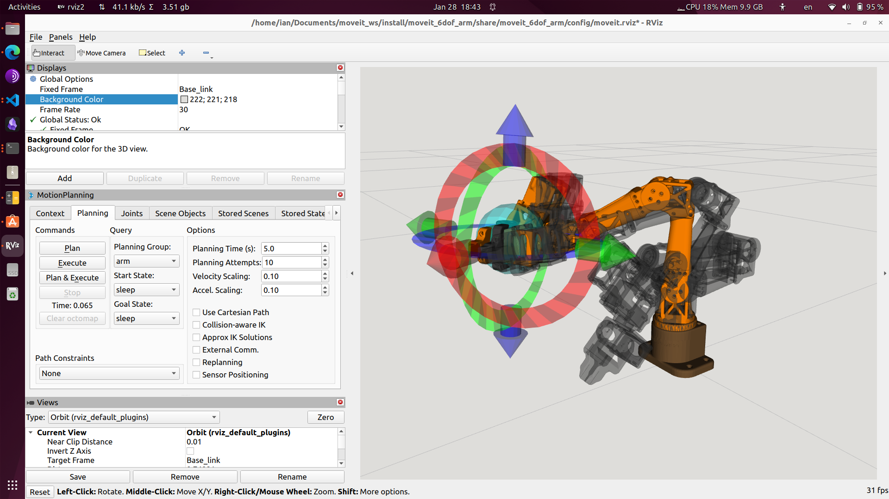
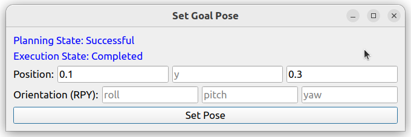
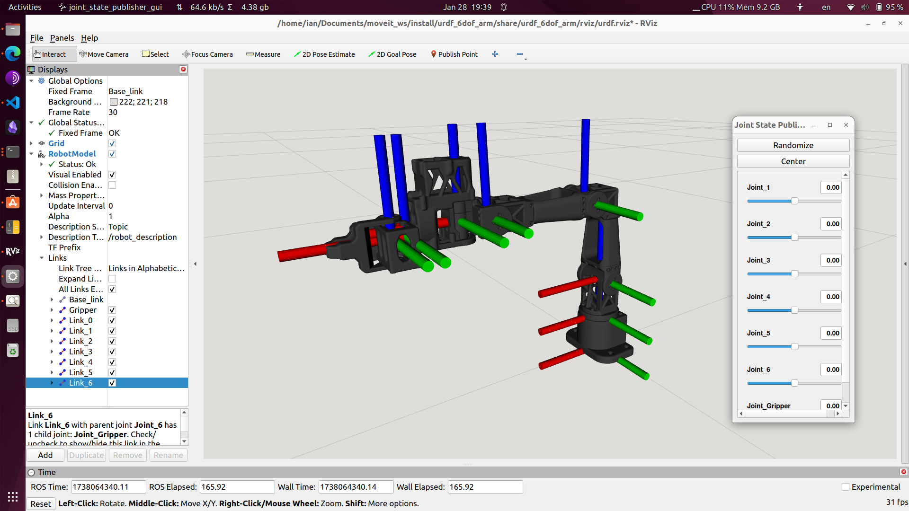

# Feetech Arm Control

This repository provides a ROS2 hardware interface, URDF model, and MoveIt configuration for controlling a 6-DoF robotic arm using Feetech motors. The 3D model is currently in beta and pending open-source release by [Simple Automation](www.SimpleAutomation.ai), please follow their progress on [X](https://x.com/viktor_vrp)!


## ✨ Features

- **Udev Rules for Serial Communication**
  - Provides consistent device names.

- **MoveIt 2 Integration**
  - Supports intuitive end-effector control in RViz.
  - Includes a GUI for setting goal poses (XYZ & RPY).

- **Simulation & Hardware Compatibility**
  - Works in both RViz simulation and real-world hardware.
  - Publishes actual joint state feedback to a ROS topic.

- **Robot Description & Configuration (Git Submodule)**
  - Uses URDF/XACRO for robot modeling.
  - Includes SRDF for MoveIt 2 configuration.
  - Defines joint limits, collision models, and kinematics.

- **TODO**
  - [ ] Display actual joint state feedback in RViz.
  - [ ] Implement or integrate an IK solver.

## 🚀 Installation

### 1️⃣ Clone the repository into your ROS2 workspace:
```bash
cd ~/your_ros2_ws/src
git clone https://github.com/iltlo/feetech_arm_control.git
```

### 2️⃣ Install dependencies:
```bash
cd ~/your_ros2_ws/src/feetech_arm_control
git submodule update --init --recursive
pip install feetech-servo-sdk
```

### 3️⃣ Set Up Udev Rules (Mandatory for Serial Communication)
To ensure consistent device naming and prevent permission issues, the Feetech Arm requires a udev rule.

#### 📌 Steps to Install Udev Rules

1. Run the setup script:
    ```bash
    cd ~/your_ros2_ws/src/feetech_arm_control/scripts
    chmod +x setup_udev.sh
    sudo ./setup_udev.sh
    ```
2. Unplug and replug the USB cable to apply the changes.
3. Verify the device is detected:
    ```bash
    ls -l /dev/ttyARM*
    ```
    You should see something like:
    ```bash
    lrwxrwxrwx 1 root root 7 Feb 14 00:48 /dev/ttyARM0 -> ttyACM0
    lrwxrwxrwx 1 root root 7 Feb 14 00:52 /dev/ttyARM1 -> ttyACM1
    ```
### 4️⃣ Build and source the workspace:
```bash
colcon build && source ~/your_ros2_ws/install/setup.bash
```

## 🎮 Usage

### 🔹 MoveIt! Demo

To run the MoveIt 2 demo for End Effector drag-and-drop control:
```bash
ros2 launch arm_moveit_config feetech_moveit.launch.py
```

To use a Qt5 GUI for controlling the arm pose:
```bash
ros2 launch arm_controller ee_goal_control.launch.py
```

To run with the actual hardware (Optional):
```bash
ros2 run arm_hardware_interface hardware_interface
```




### 🔹 Display in RViz

To display the robot model in RViz:
```bash
ros2 launch arm_description display.launch.py
```



## 🛠 Development Environment
- Ubuntu 22.04
- ROS2 Humble
